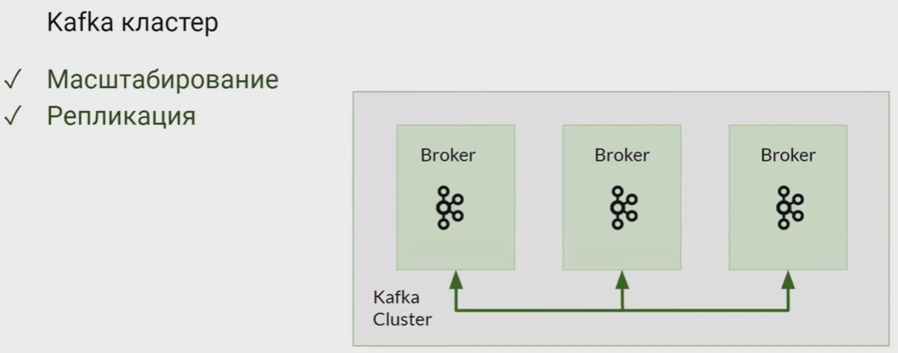
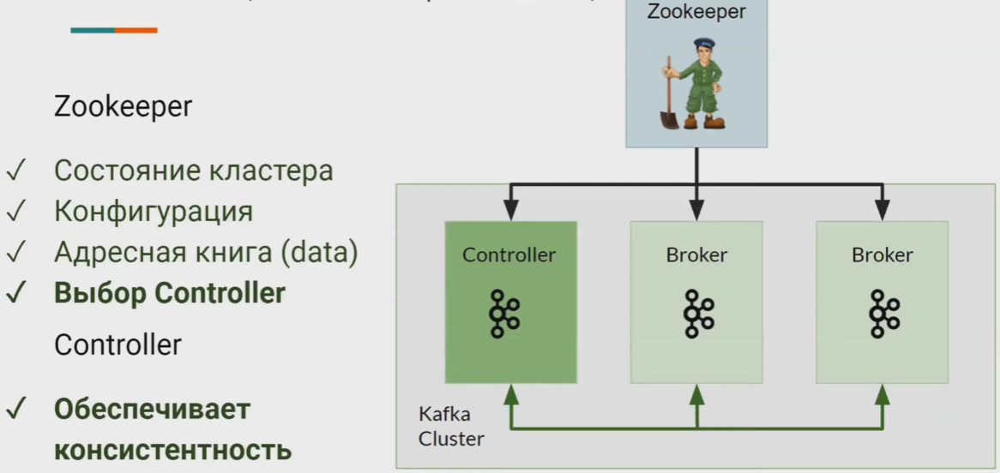
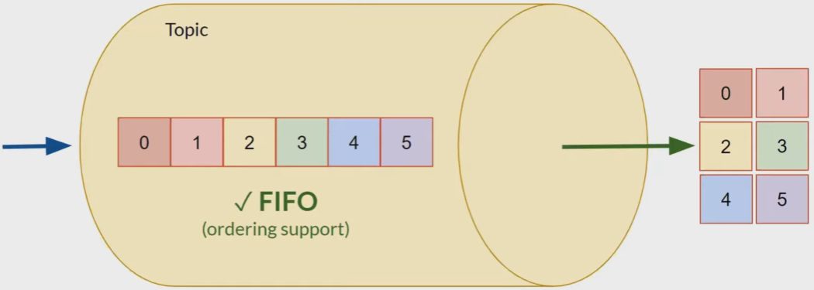
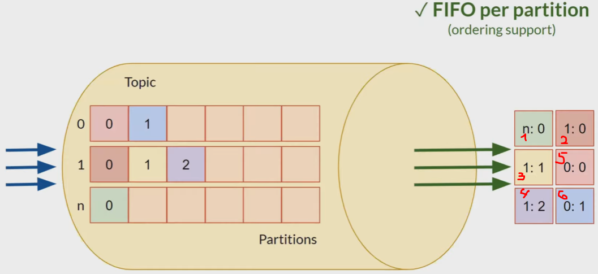
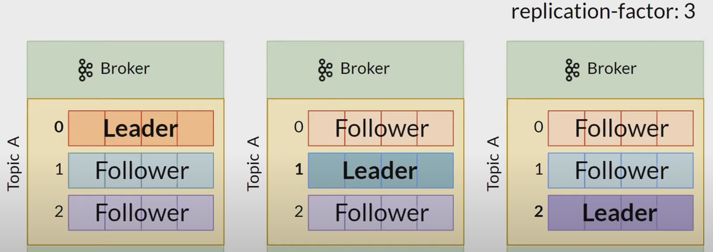

= Про Kafka (основы)

Source: link:https://www.youtube.com/watch?v=-AZOi3kP9Js[Про Kafka (основы)]

*Content:*

- 1) Свойства Kafka
- 2) Broker
- 3) Message
- 4) Topic/Partition
- 5) Размещение топика (его партиций) по кластерам
- 6) Хранение данных
- 7) Data replication
- 8) Оффсеты

=== 1) Свойства Kafka

- Распределенность
- Отказоустойчивость
- Высокая доступность
- Надежность и согласованность данных
- Высокая производительность (пропускная способность) (кейсы 1М msg per sec)
- Горизонтальное масштабирование
- Интегрируемость с другими системами

===== Основные сущности Kafka:

- Broker
- Zookeeper (теперь не нужен, link:https://habr.com/ru/company/otus/blog/670440/[habr], используется протокол KRaft)
- Message (Record)
- Topic/Partition
- Producer
- Consumer

=== 2) Broker

Брокер = кафка сервер, кафка нода. Он отвечает за:

- Прием сообщений
- Хранение сообщений
- Выдачу сообщений

Брокеров обычно много, для отказоустойчивости и производительности. Они между собой общаются, создавая *_Kafka-кластер_*. Таким образом мы можем производить масштабирование нашего кластера и репликацию данных:

Среди всех брокеров выделяется специальный брокер, который называется *_Controller_*, и он обеспечивает консистентность данных, Kafka - это master-slave система. Данные о контроллере (а также о других параметрах Kafka хранятся либо в Zookeeper, либо в KRaft):

=== 3) Message

Message - это key-value пары, основные аттрибуты:

[cols="1,8"]
|===

|Key
|Опциональный ключ, используется для распределения сообщений по кластеру

|Value
|Содержимое сообщения - массив байт

|Timestamp
|Время отправки, опциональное (если не установлено - брокер сам проставит это поле)

|Headers
|Набор key-value пар

|===

=== 4) Topic/Partition

*_Topic_* это стрим данных, это тупо труба с событиями (мессаджами), которые прилетели от разных продъюсеров. В случае одной партиции очередность чтения в Kafka поддерживается.

Но одна очередь для топика - это мало, особенно в случаях больших нагрузок, поэтому придумали *_Partitions_*. Количество партиций конфигурируется. Если у нас 3 партиции, то у нас в топик могут одновременно писать 3 продьюсера, а из топика могут в параллель из разных партиций в разных потоках читать несколько консьюмеров. +
В этом случае каждый продьюсер пишет в свою партицию, а консьюмер по очереди считывает данные из каждой партции, и он получает данные, упорядоченные per partition. Т е в целом порядок не тот (ибо продьюсеры могут даже писать одновременно), но per partition (иногда и per producer) сообщения упорядочены:

=== 5) Размещение топика (его партиций) по кластерам

Партиции распределяются по брокерам. Иногда все на разных, иногда все партиции на одном. Это не всегда хорошо (один жирный топик на одном брокере), поэтому можно сконфигурировать распределение партиций для отдельных топиков.

TODO: watch video.

=== 6) Хранение данных

Папка logs/... у брокера +
там есть папки под каждую партицию ("topicname_0", "topicname_1")
В папке три файла:

1. ...0000.log  -> все данные о сообщении (Offset | Position | Timestamp | Message), где position - номер байта в файле, с которого надо читать текцщее сообщение
2. ...0000.index -> mapping position на offset (Offset | Position)
3. ...0000.log -> mapping timestamp на offset (Timestamp | Offset)

А если их много - то появляются новые файлы (при превышении 1Гб создаются новые файлы) - ...0002.log, ...0002.index,.. (новый сегмент). У каждого сегмента есть timestamp.

TODO: watch video.

Удалять данные из кафки нельзя, но есть автоудаление по TTL (time to leave). Удаляются целиком сегменты партиций, каждый сегмент считает свое время жизни от максимального timestamp в своих сообщениях

=== 7) Data replication

- Replication-factor
- Пусть всего 3 реплики при replication-factor = 3 (и 3 нодах) реплик будет 9.
- Есть лидер реплики и фолловеры. ЧИТАТЬ И ПИСАТЬ МОЖНО ТОЛЬКО В ЛИДЕРА! Не с фолловерами.
- Лидер-реплики назначает Кафка-Контроллер.
- Даные в фолловерах иногда отстают от лидера

=== 8) Оффсеты

Партиция / Группа / Оффсет

Если консьюмер упадет, то другой консьюмер из этой же группы будет читать уже новые сообщения, а не те же самые, из той же партиции.

Типы коммита (от консьюмера):

- Autocommit (at most one) - плохо, ибо может прочитать сообщения, закоммитить и сразу упасть
- Manual commit (at least one) - закоммитить только после обработки, в коде. Проблема - прочитали 50, обработали 10 и упали.
- Custom offset management (не в кафке, а в базе сохраняем оффсет и всегда консьюмер запрашивает специфический оффсет).

